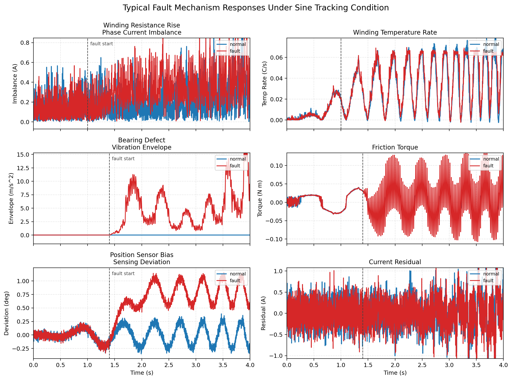
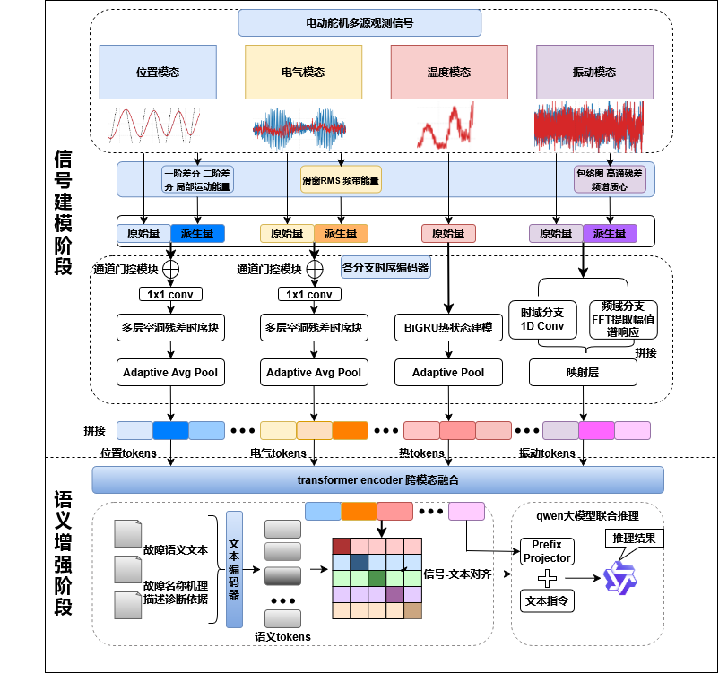
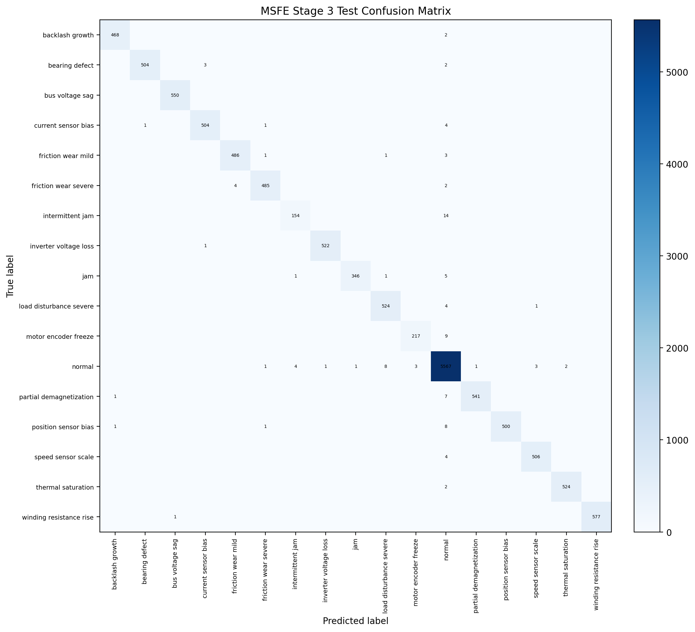
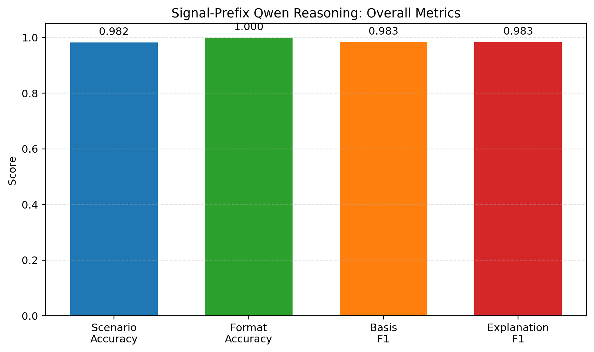

# 基于四类信号模态融合与渐进语义增强的电动舵机故障诊断方法

## 摘要

针对电动舵机故障在多物理域耦合传播条件下面临的模态异构性强、故障特征不稳定以及信号表征与故障语义衔接不足等问题，提出一种面向电动舵机故障诊断的四类信号模态融合与渐进语义增强方法。依据电动舵机测量链和故障传播链路，将输入组织为位置、电气、热和振动四类信号模态，构建由信号编码和语义增强组成的两阶段诊断框架，并在语义增强阶段引入由故障名称、机理描述和诊断依据构成的语义模态；同时设计模态专属增强策略 MSFE，以强化位置、电气和振动模态中的故障敏感特征，并保留热模态原始温度量作为辅助慢变量输入。基于所构建的电动舵机闭环机电热振动耦合仿真平台数据集开展实验，语义增强阶段最优测试准确率达到 97.58%，且完整四类信号模态融合在两阶段均优于任一单模态输入。此外，结构化诊断扩展验证表明，冻结信号编码器后，所学融合表示仍可支撑故障结论、诊断依据和机理解释的生成，故障场景准确率达到 94.42%，格式准确率达到 100.00%，说明所提方法在提高电动舵机故障诊断精度的同时，也具备一定的诊断表达能力。

**关键词：** 电动舵机；四类信号模态融合；语义模态；故障诊断；结构化诊断

## 1 引言

电动舵机广泛应用于高性能运动控制、机器人关节驱动和精密执行等场景，是集驱动电机、功率变换器、机械传动机构、传感器与控制器于一体的闭环伺服执行单元，其健康状态直接影响执行精度、动态响应和系统安全性[9-11]。与一般开环执行部件相比，电动舵机在运行过程中同时受到控制律、负载扰动、传动间隙、热积累和传感反馈等多种因素影响，故障传播过程具有明显的跨部件、跨环节耦合特征。故障在电动舵机中往往沿“局部异常注入—对象响应变化—控制补偿耦合—多模态反馈显现”的链路传播，最终在位置、电流、电压、温度和振动等多个物理域中表现为耦合症状。单一模态通常只能反映故障传播链路中的局部响应，且易受工况变化、传感噪声和局部可观测性限制，因此有必要构建面向电动舵机对象机理的多模态融合诊断方法[1-2,9-11]。

围绕复杂机电系统故障诊断问题，相关研究已由基于阈值规则和人工特征的传统方法，逐步发展到基于机器学习和深度学习的时序建模方法。对于电动舵机及类似闭环执行机构而言，电流、位置、温度和振动等信号分别刻画驱动状态、跟踪行为、热积累过程和局部机械冲击信息，多源信息融合有助于提高复杂工况下的故障识别能力与诊断稳定性[1-3,10]。近年来，深度神经网络在多源异构时序建模中的应用不断增加，多编码器结构、Transformer 融合结构以及跨模态特征学习方法，为复杂对象故障诊断提供了新的技术路径[3-5,10-11]。

与此同时，故障诊断研究正由“是否能够正确分类”逐步拓展到“能否给出诊断依据和机理解释”。随着大语言模型和跨模态语义建模方法的发展，利用故障描述文本、维修知识和结构化解释模板对信号表示进行语义约束，已成为提升诊断可解释性和知识扩展能力的重要方向[6-8]。对于电动舵机这类机电热振动强耦合对象，如何在保持多模态故障诊断精度的同时，建立从融合信号表示到故障语义表达之间的有效映射，具有较强的工程背景和研究意义。

尽管现有多模态故障诊断方法已取得一定进展，但在电动舵机场景下仍面临三个关键问题：不同模态在物理含义、时间尺度和统计分布上差异明显，直接拼接输入容易混入工况差异和控制补偿信息；不同信号模态对故障的敏感性并不一致，统一前端难以兼顾强模态判别特征与弱模态辅助证据；仅依赖类别标签监督时，融合信号表示与故障机理描述、诊断依据表达之间仍缺乏稳定衔接。针对上述问题，本文依据电动舵机测量链和故障传播链路构建位置、电气、热和振动四类信号模态输入体系，提出信号编码与语义增强相结合的渐进式诊断框架，并在四类信号模态融合基础上进一步引入由故障名称、机理描述和诊断依据构成的语义模态。同时，结合模态专属增强策略 MSFE，提高不同物理域故障敏感特征的提取能力，并通过多组对比实验与结构化诊断扩展验证对所提方法的有效性进行检验[2-8]。

## 2 方法

### 2.1 对象机理与问题定义

电动舵机由驱动电机、功率变换器、机械传动机构、传感器和闭环控制器共同构成，故障传播通常沿着“局部异常注入-对象响应变化-控制补偿耦合-多模态可观测响应增强”的链路展开。为直观说明这一特点，本文选取正弦跟踪工况下三类代表性故障进行机理说明，如图 2 所示。绕组电阻升高会直接引起相电流不平衡增强，并带动温升速率提高；轴承缺陷会诱发振动冲击及其边带调制，并进一步加剧摩擦转矩波动；位置传感器偏置则首先表现为位置测量偏差增大，随后通过闭环调节传递到电流残差变化。上述现象表明，不同故障虽起源于电气链、机械链或传感链，但都会在位置、电气、热和振动等多个物理域中形成耦合响应，这构成了本文开展四类信号模态融合故障诊断的对象基础。

图 2 正弦跟踪工况下典型故障机理组合图

基于上述对象机理，电动舵机故障诊断的核心任务，是根据故障在位置、电气、热和振动等多个物理域中的耦合响应，对其故障类别进行识别。与一般单源时序分类问题不同，本文所讨论的多模态既包括位置、电气、热和振动四类信号模态，也包括后续语义增强阶段引入的语义模态。围绕这一诊断任务，电动舵机多模态融合面临三类直接困难：一是不同信号模态在物理含义、时间尺度和统计分布上差异明显，直接拼接容易混入工况变化和控制补偿信息；二是电气和位置模态通常表现为强敏感模态，而热和振动模态更多承担辅助证据作用，简单融合容易造成强弱模态失衡；三是若仅以类别标签进行监督，融合信号表示难以与故障机理描述和诊断依据建立稳定对应关系。基于此，本文将问题定义为面向电动舵机对象机理的四类信号模态融合故障诊断任务，并在后续语义增强阶段进一步引入语义模态，以建立信号表征与故障语义之间的显式对应关系。

本文将电动舵机故障诊断建模为基于固定长度时序窗口的多分类任务。设单个样本记为 $\mathbf{X}=\{\mathbf{X}^{p},\mathbf{X}^{e},\mathbf{X}^{th},\mathbf{X}^{v}\}$，其中 $\mathbf{X}^{p}$、$\mathbf{X}^{e}$、$\mathbf{X}^{th}$ 和 $\mathbf{X}^{v}$ 分别表示位置模态、电气模态、热模态和振动模态的时间窗口输入。本文按照单一主模态归属原则组织原始观测量，使每个观测通道对应明确的物理语义边界，从而保证主模态定义的物理独立性与可解释性。位置模态包括测量角度、电机侧角度、电机侧速度及编码器计数；电气模态包括电流、电压和母线相关反馈量；热模态包含绕组温度和壳体温度两个原始温度通道；振动模态包含振动加速度信号。由此形成与电动舵机实际测量链及故障传播链路一致的四类基础观测，并为后续原始量与派生量联合建模提供清晰的输入边界。

模型需要学习从四类信号模态窗口样本到故障类别标签的映射 $f_{\Theta}(\mathbf{X})\rightarrow y$。在主任务之外，每个样本还可关联故障名称、故障机理描述和诊断依据文本，用于后续语义增强阶段构建语义模态，并建立信号表征与诊断知识之间的对应关系。为此，本文采用渐进式训练思想，在训练早期先建立稳定的信号模态内编码，再逐步引入模态间融合和故障语义对齐。该过程能够在不同物理域统计特性存在差异的前提下，构建兼具模态专属性、互补利用能力和语义扩展能力的统一融合诊断表征空间。

### 2.2 整体架构与模态编码器设计

如图 1 所示，本文整体架构由信号编码阶段和语义增强阶段组成，遵循“对象机理驱动的模态组织-分支独立编码-统一表征序列融合-故障语义增强”的设计思路。电动舵机四类观测信号具有明显异构性：位置模态和电气模态同时受到指令输入、控制补偿和负载扰动影响，存在较强非平稳性与多时间尺度耦合；热模态变化缓慢、累积性强，在短时间窗口内故障信息较弱；振动模态则同时包含冲击瞬态和谱线变化，且易受背景噪声干扰。基于此，本文首先按照物理来源完成主模态划分；其中位置、电气和振动模态由原始量与故障敏感派生量共同构成，热模态保留原始温度量，相关派生量的具体构造见 2.4 节。这样处理的目的在于，一方面保持不同物理域的语义边界，另一方面在编码前显式突出对故障更敏感的局部动态、能量分布和冲击响应。

在信号侧，四类信号模态分别进入独立编码器，得到位置、电气、热和振动表征序列；随后，各分支输出统一投影到共享向量表征空间，并送入后续跨模态融合模块。之所以采用这种“先分支编码、后统一融合”的结构，是因为不同模态在量纲尺度、时间分辨率和故障敏感性上存在明显差异，若直接在原始特征层面进行混合，容易出现强模态掩盖弱模态、局部敏感特征被平均化的问题。在本文设置下，位置模态输出 20 个表征单元，电气模态输出 24 个表征单元，热模态输出 8 个表征单元，振动模态输出 12 个表征单元，拼接后形成长度为 64 的信号表征序列。各模态表征经层归一化、线性映射、GELU 激活和 Dropout 正则化后映射到统一表征维度，作为分类头、融合编码器和语义增强模块的公共输入。

记第 $m$ 个模态编码器为 $h_m(\cdot)$，则对应模态的表征序列可表示为
$$
\mathbf{T}^{m}=h_m(\mathbf{X}^{m})\in \mathbb{R}^{K_m\times d},
$$
其中 $m\in\{p,e,th,v\}$，$K_p=20$、$K_e=24$、$K_{th}=8$、$K_v=12$，$d$ 为统一表征维度。四个模态的表征序列按模态顺序拼接得到共享信号序列
$$
\mathbf{T}^{s}=[\mathbf{T}^{p};\mathbf{T}^{e};\mathbf{T}^{th};\mathbf{T}^{v}]\in \mathbb{R}^{64\times d}.
$$
该表示既保留了模态边界，又为后续统一融合和语义对齐提供了标准化输入。

在跨模态交互层中，本文采用 Transformer 编码器，而不是对模态特征进行简单拼接或加权求和。其原因在于，电动舵机故障往往沿着“电气链—机械链—热链—传感链”跨域传播，不同模态之间的关联强度会随工况和故障类型动态变化。简单拼接只能保留并列关系，难以显式建模模态间的依赖传播；加权求和虽然能够完成粗粒度融合，但会过早压缩表征单元之间的差异，容易削弱局部敏感特征和模态边界信息。相比之下，Transformer 编码器可通过自注意力机制在表征单元层面自适应建立跨模态关联，使位置、电气、热和振动表征在统一空间内选择性关注与当前故障更相关的其他模态信息，因此更适合处理电动舵机多物理域耦合条件下的跨模态交互建模。

对 20/24/8/12 这组表征单元数的设置，本文综合考虑模态信息量、故障敏感性和计算代价。电气、位置、振动和热模态分别分配 24、20、12 和 8 个表征单元，最终形成长度为 64 的信号表征序列，以兼顾强信息模态的表达容量和整体训练开销。

图 1 电动舵机四类信号模态与语义模态协同故障诊断总体框架

针对位置模态，电动舵机角度、速度和编码器计数信号会同时受到参考输入变化、执行机构跟踪误差和机械链间隙扰动影响，容易出现局部突变、动态滞后和多尺度波动共存的问题。为此，本文采用带通道门控的时序编码器，并在逐点卷积之后叠加多层空洞残差块，对不同时间尺度上的位置演化模式进行分层提取。空洞残差块由深度空洞卷积、逐点卷积、门控单元和残差连接构成，空洞率按 1、2、4、8 递增，以兼顾局部动态细节保留和长时间范围跟踪误差传播刻画。

针对电气模态，电流、电压和母线反馈信号既包含电机驱动链的快速响应，又叠加了负载耦合和控制补偿效应，常表现为幅值起伏、频带响应变化和瞬态扰动并存。为此，本文对电气模态采用与位置模态相同的时序编码主干，即“通道门控—逐点卷积—多层空洞残差块—池化”链路，以增强滚动均方根、频带能量和原始电气量之间的协同建模能力。该网络能够在统一编码框架下同时提取电气信号中的短时异常和跨周期演化特征。

针对热模态，绕组温度和壳体温度属于典型慢变量，其故障表征通常体现为持续升温、热惯性和状态滞后，而非明显的高频突变。因此，本文采用双向门控循环单元热状态编码器，直接对温度时序进行双向建模，再通过池化生成热表征序列。该结构更适合刻画热状态的累积过程和前后时刻之间的依赖关系，也有利于在较短样本窗口内保留慢变故障信息。

针对振动模态，轴承缺陷、摩擦磨损和局部机械冲击往往同时表现为时域冲击增强和频域谱线偏移，而且信号容易受到背景噪声和工况变化影响。为此，本文采用时频联合编码器，在振动分支中并行设置时域分支和频域分支：前者使用一维卷积提取局部冲击和高频扰动模式，后者通过 FFT 提取幅值谱响应，再经映射层对齐后与时域分支结果拼接形成振动表征序列。结合原始振动量、包络、高频残差和频谱质心等输入，该结构能够同时保留瞬态冲击信息和稳态频谱分布信息。

在跨模态融合之后，模型仍面临一个问题，即仅凭类别监督虽然能够完成故障识别，但难以显式利用故障机理描述和诊断依据等语义知识。为此，在语义侧，故障文本、故障名称机理描述和诊断依据首先通过文本编码器转换为语义表征序列，并作为语义模态与融合后的信号表征序列建立对应关系。这样设计的目的不是简单附加文本信息，而是在统一特征空间内建立“信号模式—故障类别—诊断依据”之间的显式联系，从而提升融合表示的语义可解释性。进一步地，图中的前缀映射模块将信号侧融合表示映射为 Qwen 可接收的前缀表示，并结合文本指令完成故障结论、诊断依据和解释文本的联合推理。因此，2.2 节给出的整体架构实质上构成了一个由四类信号模态、语义模态、多分支深度神经网络、统一向量表征空间、信号-文本对齐和结构化诊断扩展接口共同组成的电动舵机多模态故障诊断框架。

### 2.3 两阶段渐进式诊断框架

面向电动舵机故障诊断，本文所讨论的多模态不仅包括位置、电气、热和振动四类信号模态，也包括由故障名称、故障机理描述和诊断依据构成的语义模态。考虑到信号模态与语义模态在数据形态、信息密度和收敛节奏上存在明显差异，若在训练初期直接进行全量联合融合，容易出现语义侧干扰信号侧基础表征学习、跨模态优化目标竞争过强等问题。因此，本文将训练流程归并为信号编码和语义增强两个阶段，使模型沿着“多源症状编码-故障语义约束-结构化诊断扩展”的路径逐步提升诊断能力。

第一阶段为信号编码阶段，其目标是在不引入语义模态干扰的条件下，先建立电动舵机多源可观测症状之间的稳定表征与融合关系。该阶段包含基础编码和融合编码两个步骤。基础编码步骤以前述四分支编码器为基础，将位置、电气、热和振动四类信号表征序列拼接后进行轻量汇聚，并使用分类头直接完成电动舵机故障类别预测。若记轻量汇聚算子为 $\phi(\cdot)$，分类头为 $c_1(\cdot)$，则预测过程可写为
$$
\hat{y}_1=c_1(\phi(\mathbf{T}^{s})).
$$
其作用是先学习各信号模态内部的故障敏感表征。随后，在融合编码步骤中，在拼接后的信号表征序列前加入分类表征 $\mathbf{t}_{cls}$，并通过 Transformer 编码器建模位置、电气、热和振动模态之间的交互关系，即
$$
\mathbf{H}_2=\operatorname{Transformer}([\mathbf{t}_{cls};\mathbf{T}^{s}]).
$$
经过层归一化和序列池化后，得到用于故障诊断的融合表示 $\mathbf{z}_2$。由基础编码过渡到融合编码，使第一阶段由模态内编码进一步扩展到跨模态症状关联建模。

第二阶段为语义增强阶段，其目标是在已经获得稳定信号融合表示的基础上，将故障语义知识显式引入电动舵机故障诊断过程。该阶段包含表示对齐和联合增强两个步骤。在表示对齐步骤中，使用冻结文本编码器将故障类别名称、故障机理描述和诊断依据文本映射到文本嵌入空间，并采用基于 attention mask 的均值池化获得文本全局向量 $\mathbf{z}^{txt}$。随后，通过投影层将其映射到与信号表示相同的维度，得到文本语义表示 $\tilde{\mathbf{z}}^{txt}$。对于融合后的信号表示 $\mathbf{z}^{sig}$，利用对比式对齐损失约束二者在潜在空间中相互接近，同时保留分类监督，以增强电动舵机故障类别、故障机理与融合表示之间的一致性。在联合增强步骤中，进一步将文本表征序列作为语义模态显式拼接到信号表征序列中，与分类表征一同送入联合 Transformer 编码器，形成更深层的信号-语义联合交互，即
$$
\mathbf{H}_4=\operatorname{Transformer}([\mathbf{t}_{cls};\mathbf{T}^{s};\mathbf{t}^{txt}]).
$$
经过联合编码后，模型利用序列级表示输出最终故障诊断结果，并继续保留信号—文本对齐约束。由表示对齐过渡到联合增强，使第二阶段由语义约束进一步扩展到信号-语义的深层交互。

综上，本文两阶段渐进式诊断框架的底层逻辑可以概括为：第一阶段解决电动舵机多源信号如何被有效编码与融合的问题，第二阶段解决融合表示如何进一步承载故障机理、诊断依据和解释语义的问题。这样形成的诊断链路，从位置、电气、热和振动等可观测响应出发，逐步过渡到故障语义表达与结构化诊断结果，更符合电动舵机故障诊断由“症状识别”走向“机理解释”的任务需求。

在上述主线之外，本文进一步构建了结构化诊断扩展验证。该验证冻结信号编码阶段的编码器参数，并使用前缀映射模块将其输出映射为大模型前缀表示，仅向 Qwen2.5-1.5B 提供任务指令与信号表征序列，由模型输出故障结论、诊断依据和机理解释三段结构化结果。该扩展验证可视为对主线融合表示语义迁移能力的进一步验证，用于考察四类信号模态融合表示向结构化故障解释任务扩展的可行性[6-8]。

### 2.4 模态专属增强策略 MSFE

在上述两阶段主线之上，本文进一步提出模态专属增强策略 MSFE。其核心思想是，不同模态的故障敏感信息分布于不同的时间尺度和频率尺度，因此采用与模态特性相匹配的前端增强方法。对于位置模态，采用一阶差分、二阶差分和局部运动能量表征，以突出位置跟踪变化和运动学动态异常；对于电气模态，采用滚动均方根和频带能量特征，以增强电流、电压在不同频带中的故障敏感模式；对于振动模态，采用包络、高通残差和频谱质心，以提取冲击类和频谱偏移类异常；对于热模态，保留原始温度量作为慢变量辅助输入。

可以将该过程形式化写为 $\tilde{\mathbf{X}}^{m}=g_{m}(\mathbf{X}^{m})$，其中 $m\in\{p,e,th,v\}$ 表示模态索引，$g_{m}(\cdot)$ 表示对应模态的专属增强变换。MSFE 在保持四类信号模态边界不变的前提下，为不同模态增加与其物理机理相一致的补充表征。实验结果表明，这一策略是当前整条主线性能提升的主要来源。

进一步地，位置、电气和振动模态的增强形式可概括为
$$
\tilde{\mathbf{X}}^{p}=[\mathbf{X}^{p},\Delta \mathbf{X}^{p},\Delta^2 \mathbf{X}^{p},\mathbf{E}^{p}_{loc}],
$$
$$
\tilde{\mathbf{X}}^{e}=[\mathbf{X}^{e},\operatorname{RMS}_w(\mathbf{X}^{e}),\mathbf{B}^{e}_{freq}],
$$
$$
\tilde{\mathbf{X}}^{v}=[\mathbf{X}^{v},\operatorname{Env}(\mathbf{X}^{v}),\mathbf{R}^{v}_{hp},\mathbf{C}^{v}_{spec}],
$$
其中 $\mathbf{E}^{p}_{loc}$ 表示局部运动能量特征，$\operatorname{RMS}_w(\cdot)$ 表示滑窗均方根，$\mathbf{B}^{e}_{freq}$ 表示频带能量，$\operatorname{Env}(\cdot)$ 表示包络特征，$\mathbf{R}^{v}_{hp}$ 表示高通残差，$\mathbf{C}^{v}_{spec}$ 表示频谱质心。上述增强特征与原始观测量共同输入对应编码器，从而提升各模态的故障敏感信息密度。

### 2.5 结构化诊断扩展验证

为验证融合信号表示的语义迁移能力，本文在主线分类实验之外进一步设计基于信号表征序列的结构化诊断扩展验证。该验证冻结信号编码阶段的编码器参数，仅保留其输出的信号表征序列 $\mathbf{T}^{s}$，并通过前缀映射模块将其映射为固定长度的软前缀：
$$
\mathbf{P}=\psi(\mathbf{T}^{s})\in \mathbb{R}^{L\times d_{llm}},
$$
其中 $\psi(\cdot)$ 由层归一化、线性投影、GELU 激活、线性映射和自适应平均池化构成，$L$ 为前缀长度，$d_{llm}$ 为 Qwen2.5-1.5B 的隐藏维度。映射后的软前缀与任务指令嵌入级联后共同作为大模型输入，从而将连续信号表征转化为可被语言模型直接消费的条件前缀[8]。

在训练与推理时，本文均对输出格式施加显式结构约束，要求模型生成故障结论、诊断依据和机理解释三段结果，分别对应故障场景标签、诊断依据短语和标准化机理解释模板。该设计使结构化诊断扩展验证同时具备故障结论生成、证据表达和机理解释三种能力，也便于后续采用字段级准确率和 F1 指标进行定量评价。

### 2.6 优化目标

信号编码阶段包含基础编码和融合编码两个步骤，均使用交叉熵分类损失训练。语义增强阶段包含表示对齐和联合增强两个步骤，在分类损失基础上引入信号—文本对齐损失，总体形式为
$$
\mathcal{L}=\mathcal{L}_{cls}+\lambda \mathcal{L}_{align}.
$$
其中，$\mathcal{L}_{cls}$ 用于约束故障类别预测，$\mathcal{L}_{align}$ 用于约束信号和文本语义的一致性。本文采用双向对比式 InfoNCE 形式构造对齐损失：
$$
\mathcal{L}_{align}=-\frac{1}{2}\left[
\frac{1}{B}\sum_{i=1}^{B}\log \frac{\exp(\operatorname{sim}(\mathbf{z}^{sig}_i,\mathbf{z}^{txt}_i)/\tau)}{\sum_{j=1}^{B}\exp(\operatorname{sim}(\mathbf{z}^{sig}_i,\mathbf{z}^{txt}_j)/\tau)}
+
\frac{1}{B}\sum_{i=1}^{B}\log \frac{\exp(\operatorname{sim}(\mathbf{z}^{txt}_i,\mathbf{z}^{sig}_i)/\tau)}{\sum_{j=1}^{B}\exp(\operatorname{sim}(\mathbf{z}^{txt}_i,\mathbf{z}^{sig}_j)/\tau)}
\right],
$$
其中 $B$ 为 batch 大小，$\operatorname{sim}(\cdot,\cdot)$ 为归一化余弦相似度，$\tau$ 为温度系数。该设计使模型在提高分类性能的同时，逐步获得更强的故障语义可分性。

对于结构化诊断扩展验证，冻结信号编码阶段的编码器参数后，仅对前缀映射模块与大模型侧轻量参数进行训练，并采用自回归语言建模损失
$$
\mathcal{L}_{lm}=-\sum_{t}\log p(w_t|\mathbf{P},\mathbf{I},w_{<t}),
$$
其中 $\mathbf{P}$ 为信号前缀，$\mathbf{I}$ 为任务指令，$w_t$ 为目标输出词元。

## 3 实验设置

### 3.1 仿真平台、数据构建与预处理

本文数据来自电动舵机闭环机电热振动耦合仿真平台。平台包含电机电气子系统、双惯量机械传动子系统、热子系统、振动响应合成模块、传感器测量链和级联伺服控制器，并在多工况下对负载扰动、摩擦磨损、间隙增长、卡滞、轴承缺陷、绕组参数漂移、逆变器异常和传感器失准等多类故障进行参数化注入。连续仿真信号经滑动窗口采样后形成诊断样本，窗口长度为 256，步长为 64。数据集按故障类别进行窗口级分层随机划分，其中训练集、验证集和测试集比例分别为 70%、15% 和 15%，所有标准化统计量仅由训练集计算得到。

在数值预处理方面，本文对四类信号模态分别进行逐通道 Z-score 标准化，以减小不同模态量纲差异对训练稳定性的影响。对文本语义分支而言，本文构建了与故障场景一一对应的语义语料，内容包括故障类别名称、故障机理描述、诊断依据短语和标准化解释模板，并通过冻结文本编码器预先编码缓存，以减少训练阶段的重复推理开销。为统一热模态口径，本文分类主实验、结构化诊断扩展验证以及四类信号模态与单信号模态对比实验中的热模态，均仅保留绕组温度与壳体温度两个原始温度通道。

在训练配置方面，本文统一采用 AdamW 优化器，批量大小设为 16，权重衰减系数设为 $1\times10^{-4}$，随机种子设为 7，并以验证集场景准确率最高的检查点作为最终测试模型。信号编码阶段中的基础编码步骤训练 36 轮，学习率设为 $1\times10^{-3}$，标签平滑系数设为 0.05；融合编码步骤训练 20 轮，学习率设为 $3\times10^{-4}$，标签平滑系数设为 0.05。语义增强阶段中的表示对齐与联合增强步骤均训练 16 轮，学习率设为 $2\times10^{-4}$，标签平滑系数设为 0.03；其中表示对齐步骤的信号—文本对齐损失权重设为 0.15，联合增强步骤的对齐损失权重设为 0.08。

### 3.2 对比方法与评价指标

为了验证所提方法的有效性，本文从四个层面开展对比。第一类对比为基线与 MSFE 增强版在信号编码阶段和语义增强阶段上的直接比较，用于验证模态专属增强的作用。第二类对比为与传统时序模型的比较，包括 CNN-TCN、BiLSTM、ResNet-FCN、Transformer 编码器和双分支交叉注意力模型，用于验证所提方法相对于常见深度时序基线的优势。第三类对比为四类信号模态与单信号模态对比实验，在与完整四类信号模态主实验一致的网络结构和训练流程下，分别仅保留位置、电气、热和振动单一信号模态输入，用于分析完整四类信号模态融合相对于单模态建模的性能优势以及不同信号模态在当前方法框架下的单模态输入性能。第四类对比为结构化诊断扩展验证，用于分析冻结信号编码器后，大语言模型对结构化诊断结果的生成与表达能力。分类实验主要评价指标采用测试集场景准确率，并结合混淆矩阵对模型误差分布进行辅助分析；对于四类信号模态与单信号模态对比实验，重点比较完整四类信号模态模型与各单模态模型在测试集场景准确率上的差异，以评估信号模态融合增益和单一信号模态输入条件下的性能表现；对于结构化诊断扩展验证，进一步统计故障场景准确率、三段式格式准确率、诊断依据 F1 以及解释文本 F1。在解释文本评价中，为避免自由生成语句的同义改写对结构化指标造成过大干扰，本文采用按故障场景映射的标准化解释模板进行对齐统计。

## 4 结果与分析

### 4.1 信号编码阶段与语义增强阶段结果

表 1 给出了基线与 MSFE 增强版在两阶段各步骤上的测试结果。仅采用四类信号模态的基线模型已经取得较高性能，引入 MSFE 后，各步骤结果继续提升，说明该策略不仅改善了电动舵机多源信号的底层表征质量，也提高了后续语义增强过程的稳定性。

| 阶段步骤 | 基线测试准确率/% | MSFE 测试准确率/% |
| --- | ---: | ---: |
| 信号编码-基础编码 | 92.37 | 95.42 |
| 信号编码-融合编码 | 95.79 | 96.97 |
| 语义增强-表示对齐 | 95.61 | 97.58 |
| 语义增强-联合增强 | 95.28 | 97.42 |

从阶段变化看，信号编码阶段由基础编码过渡到融合编码后，性能继续提升，说明位置、电气、热和振动四类信号完成统一编码后，跨模态融合确实增强了多源症状之间的互补关系。进入语义增强阶段后，故障名称、机理描述和诊断依据等语义信息进一步拉开了相近故障类别之间的表征边界。基线的阶段最优结果出现在信号编码阶段的融合编码步骤，MSFE 版本的最优结果出现在语义增强阶段的表示对齐步骤，测试准确率达到 97.58%。这说明，在当前任务设置下，模态专属增强与信号—文本对齐的组合更有利于提升电动舵机故障诊断精度。

语义增强阶段的联合增强步骤在显式信号-语义联合交互条件下仍取得 97.42% 的较高准确率，但较表示对齐步骤略有下降。这说明，文本表征参与更深层联合编码后，模型虽然获得了更强的语义承载能力和后续结构化扩展潜力，但联合优化难度也随之增加。因此，语义增强阶段中的最优结果被作为主结果，同时保留联合增强步骤，用于验证信号表示向更深层语义交互扩展的能力。

为进一步观察主结果模型在各故障类别上的识别情况，图 3 给出了 MSFE 语义增强阶段最优设置在测试集上的混淆矩阵。可以看出，大多数故障类别集中分布在主对角线上，说明该设置已经能够较稳定地区分电动舵机多类典型故障模式。

图 3 MSFE 语义增强阶段最优设置测试集混淆矩阵

### 4.2 与传统模型的比较

为验证方法的相对优势，表 2 将传统时序模型与本文代表性实验结果进行比较。考虑到传统模型均为单阶段纯信号分类器，而本文语义增强阶段已经引入文本语义约束，因此此处主要选取信号编码阶段的代表结果进行对比。传统模型中的最佳结果由 Transformer 编码器给出，但其测试准确率仍明显低于本文信号编码阶段结果，说明四类信号模态输入组织与渐进式融合框架在纯信号诊断层面仍具有明显优势。

| 方法 | 测试准确率/% |
| --- | ---: |
| BiLSTM | 64.69 |
| CNN-TCN | 84.82 |
| ResNet-FCN | 85.36 |
| Transformer Encoder | 85.73 |
| Dual-Branch XAttn | 80.51 |
| 本文方法（信号编码阶段，无 MSFE） | 95.79 |
| 本文方法（信号编码阶段，含 MSFE） | 96.97 |

进一步比较可见，Transformer 编码器虽然是传统模型中的最佳结果，但仍低于本文方法在信号编码阶段的两种设置；同时，含 MSFE 的信号编码阶段结果较无 MSFE 设置又提高了 1.18 个百分点。需要说明的是，表 2 为保证与传统单阶段纯信号分类模型的对比口径一致，仅列出信号编码阶段结果；若计入语义增强阶段，本文全文最高测试准确率为 97.58%。这表明，围绕对象机理和模态特性构建输入组织方式、渐进式训练路径以及模态专属增强策略，能够在纯信号故障诊断层面持续提升电动舵机多模态诊断性能。

### 4.3 结构化诊断扩展验证

在主线分类实验之外，本文进一步开展结构化诊断扩展验证。该验证冻结 MSFE 主线中信号编码阶段的编码器参数，仅保留其输出的信号表征序列，并通过前缀映射模块将其映射为 Qwen2.5-1.5B 的前缀表示。该验证以任务指令与信号表征序列作为输入，要求模型输出故障结论、诊断依据和机理解释三段结构化结果，从而考察四类信号模态融合表示的故障语义承载能力[6-8]。

实验结果表明，经增强后的结构化诊断扩展验证在测试集上取得了 94.42% 的故障场景准确率和 100.00% 的三段式格式准确率，诊断依据字段的平均 F1 达到 0.9504，解释字段平均 F1 达到 0.9502。图 4 给出了各项结构化推理指标概览。该结果说明，当前四类信号模态融合表示在保持主线分类能力之外，具备一定的结构化诊断表达能力，可作为所提方法语义迁移能力的补充验证。

图 4 结构化诊断扩展验证指标概览

### 4.4 四类信号模态与单信号模态对比分析

为突出完整四类信号模态主实验相对于单模态建模的优势，本文在保持网络结构和训练流程一致的条件下，分别构建仅保留位置、电气、热和振动单一信号模态输入的对比实验。该组实验与主实验采用一致的网络结构、训练流程和模态专属输入组织方式，其中热模态仅保留绕组温度与壳体温度两个原始温度通道。表 3 汇总了信号编码阶段融合编码步骤与语义增强阶段表示对齐步骤的测试结果。

| 输入设置 | 信号编码-融合编码/% | 语义增强-表示对齐/% |
| --- | ---: | ---: |
| 四类信号模态融合 | 96.97 | 97.58 |
| 仅位置模态 | 91.62 | 90.55 |
| 仅电气模态 | 89.50 | 90.32 |
| 仅热模态 | 55.46 | 55.30 |
| 仅振动模态 | 65.70 | 64.69 |

综合表 3 可以看出，完整四类信号模态融合在信号编码阶段和语义增强阶段均优于任一单模态输入。以语义增强阶段表示对齐步骤为例，四类信号模态模型测试准确率达到 97.58%，较仅位置、电气、热和振动单模态输入分别提高 7.03、7.26、42.28 和 32.89 个百分点。该结果说明，位置、电气、热和振动信号之间存在明显互补性，而在此基础上融入语义模态后，模型能够更完整地表征电动舵机故障在运动学、电气响应、温升累积和局部机械异常等方面的综合特征。

从单模态输入结果看，位置模态和电气模态表现出较强的判别能力，说明运动学响应和电气响应中包含较为直接的故障判别信息；振动模态能够提供一定的局部机械异常证据，但单独建模时稳定性相对有限；热模态在仅保留原始温度通道的条件下准确率明显低于位置和电气模态，说明其更适合作为反映温升累积和热状态滞后的辅助慢变量参与融合建模。总体而言，单模态结果验证了各类信号均包含故障信息，而完整四类信号模态融合进一步强化了不同物理域之间的互补优势，因此能够取得更高的电动舵机故障诊断精度。

### 4.5 结果讨论

综合以上结果，本文围绕电动舵机故障诊断中的模态异构表征、融合建模和故障语义表达问题，构建了一条由四类信号模态输入组织、多分支深度特征提取、渐进式语义增强和结构化诊断扩展验证组成的技术路线。四类信号模态输入为融合建模提供了清晰的物理语义边界，渐进式框架进一步将语义模态引入诊断过程，MSFE 则强化了位置、电气和振动模态中的故障敏感特征。

从工程应用角度看，该方法以电动舵机对象机理为组织主线，沿着“四类信号模态编码与融合—语义模态引入—结构化诊断扩展验证”的路径，建立起“信号表征—故障类别—诊断解释”的连续链路。四类信号模态与单信号模态对比结果表明，位置、电气、热和振动信号均能提供一定诊断信息，但只有在统一融合后，不同物理域之间的互补关系才能得到更充分利用；语义增强阶段的结果进一步说明，在四类信号模态融合基础上引入语义模态，有助于提高融合表示的故障判别性与可解释性。作为补充验证，结构化诊断扩展验证结果表明，当前学习到的融合表示具备向结构化故障诊断任务迁移的能力。

需要说明的是，本文当前实验验证主要基于仿真平台构建的样本数据展开。虽然该平台能够较系统地覆盖电动舵机中的典型故障传播链路与多模态耦合响应，但与实际工程中的复杂噪声、传感漂移和工况迁移问题相比，仍存在一定差异。因此，本文结果更适合作为方法有效性的阶段性验证，后续仍需结合实测样本进行进一步评估。

## 5 结论

针对电动舵机故障在多物理域耦合传播条件下的诊断难题，本文提出了一种基于四类信号模态融合与渐进语义增强的故障诊断方法。该方法以位置、电气、热和振动四类信号模态为基础，通过信号编码阶段完成模态内建模与跨模态融合，再在语义增强阶段引入由故障名称、机理描述和诊断依据构成的语义模态，以增强融合表示的语义承载能力。基于所构建仿真平台数据集的实验结果，语义增强阶段最优测试准确率达到 97.58%，完整四类信号模态融合在两阶段均优于任一单模态输入，说明不同物理域信息之间具有明显互补性。作为补充验证，结构化诊断扩展验证结果表明，所学融合表示具备一定的结构化诊断表达能力，其故障场景准确率达到 94.42%，格式准确率达到 100.00%，诊断依据与解释 F1 均达到 0.95 左右。后续工作将围绕开放式故障解释生成以及信号驱动的大模型诊断展开。

## 参考文献

[1] Lei Y, Yang B, Jiang X, Jia F, Li N, Nandi A K. Applications of machine learning to machine fault diagnosis: A review and roadmap. Mechanical Systems and Signal Processing, 2020, 138: 106587.

[2] Kibrete F, Woldemichael D E, Gebremedhen H S. Multi-Sensor data fusion in intelligent fault diagnosis of rotating machines: A comprehensive review. Measurement, 2024, 232: 114658.

[3] Zhou F, Hu P, Yang S, Wen C. A Multimodal Feature Fusion-Based Deep Learning Method for Online Fault Diagnosis of Rotating Machinery. Sensors, 2018, 18(10): 3521.

[4] Kim S G, Park T, Kang R, Kwak Y. Domain-collaborative multimodal transformer for fault diagnosis of rotating machines under noisy environments. Advanced Engineering Informatics, 2025, 68: 103763.

[5] Han X, Cao Y, Hu P, Feng W. Multi-Modal and Multi-Condition Fault Diagnosis of Rotating Machinery via a Heterogeneous Graph Learning Framework. Information Fusion, 2026, 130: 104106.

[6] Qaid H A A M, Zhang B, Li D, Ng S K, Li W. FD-LLM: Large Language Model for Fault Diagnosis of Machines. arXiv:2412.01218, 2024.

[7] Zhang Q, Xu C, Li J, Sun Y, Bao J, Zhang D. LLM-TSFD: An industrial time series human-in-the-loop fault diagnosis method based on a large language model. Expert Systems with Applications, 2025, 264: 125861.

[8] Qwen Team. Qwen2.5 Technical Report. arXiv preprint arXiv:2412.15115, 2024.

[9] Zhang Y, Wu J, Gao B, Xia L, Lu C, Wang H, Cao G. Fault Types and Diagnostic Methods of Manipulator Robots: A Review. Sensors, 2025, 25(6): 1716.

[10] Arellano-Espitia F, Delgado-Prieto M, Martinez-Viol V, Saucedo-Dorantes J J, Osornio-Rios R A. Deep-Learning-Based Methodology for Fault Diagnosis in Electromechanical Systems. Sensors, 2020, 20(14): 3949.

[11] Raouf I, Kumar P, Kim H S. Deep learning-based fault diagnosis of servo motor bearing using the attention-guided feature aggregation network. Expert Systems with Applications, 2024, 258: 125137.
